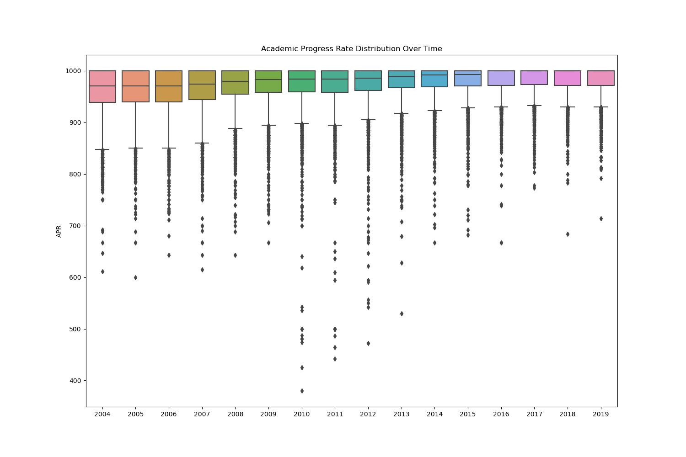
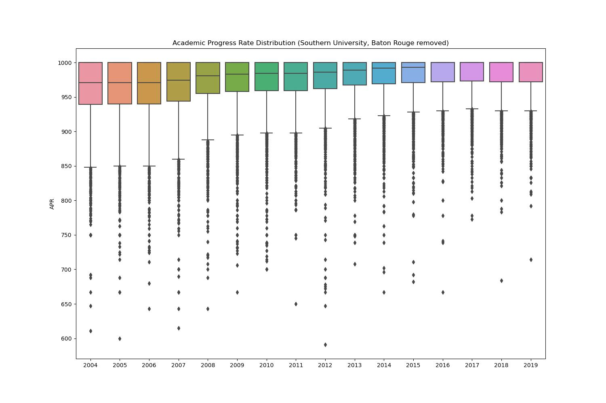
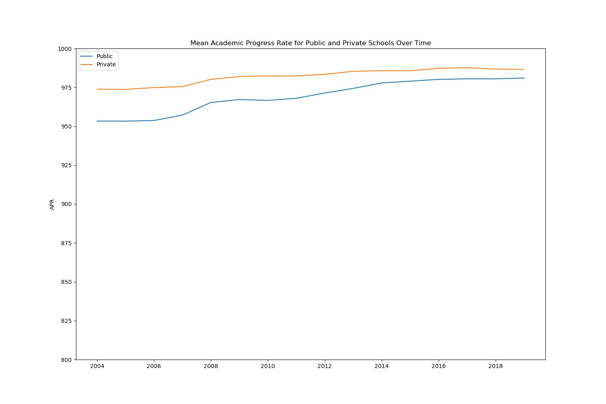
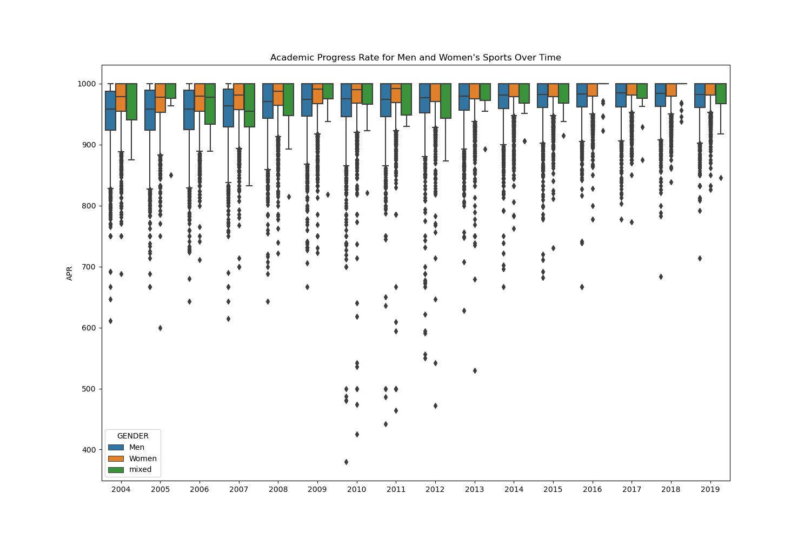
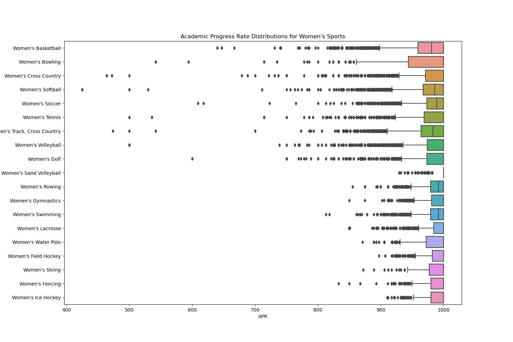
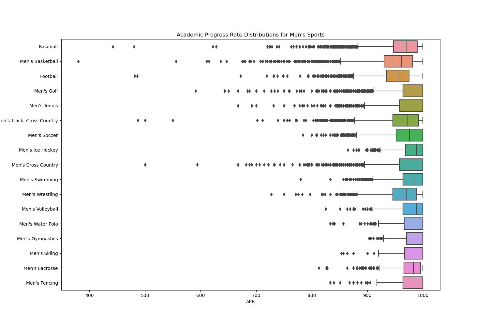
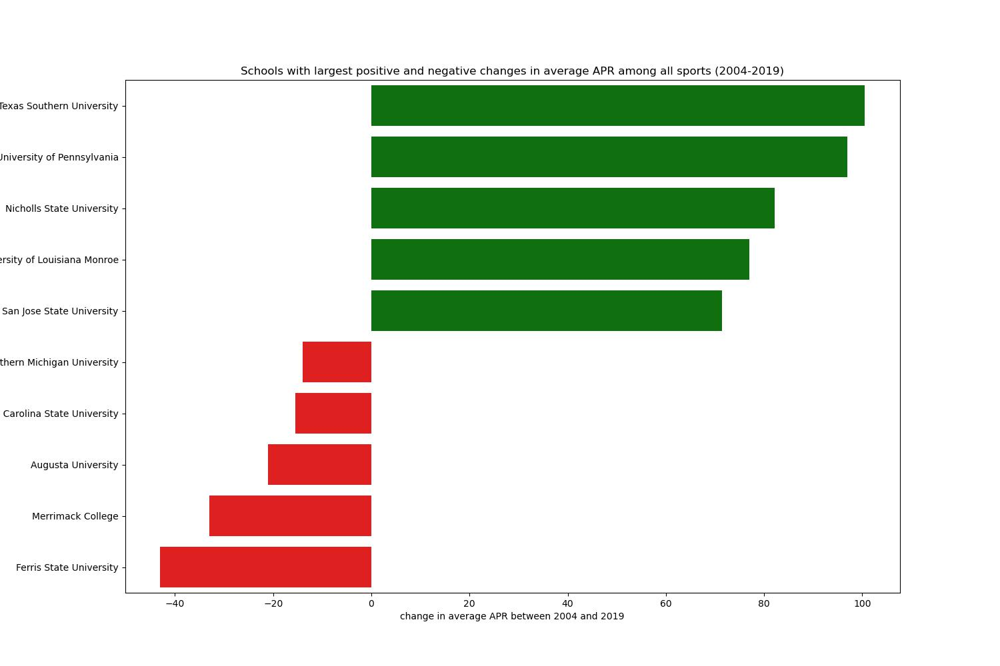

# hw-ncaa

* [NCAA student-athlete academic performance APR](https://www.ncaa.org/about/resources/research/shared-ncaa-research-data). 
  * This page has links to data and documentation for the NCAA Academic Progress Rates (APRs) of student-athletes. 
  * As of January 2023, the CSV for 2004-2019 was last updated in May 2020.
* Each questions is worth 2.5 points.
* Recommendations:
  * It's easiest to solve the entire assignment after first organizing the data into a long form (tidy) data structure as described in the [Seaborn documentation](https://seaborn.pydata.org/tutorial/data_structure.html). 
  * Consider using the [pandas.melt()](https://pandas.pydata.org/docs/reference/api/pandas.melt.html) method
  * You can answer Questions 1-3 by visualizing distributions with boxplots.
  * You can answer Questions 1 & 2 with one call (each) to seaborn. Question 3 may require 2.
  * Each questions is worth 2.5 points.
  * Although boxplots will serve the purpose of the assignment, you may find that another visualization tells the story particularly well. Feel free to use another approach if you like, just make sure to justify your choice. This is a rich dataset. Extra credit for creative EDA that extends beyond the requirements of the assignment.
* Use [git-intro](https://github.com/ds5110/git-intro) as guidance for organizing your repo

## Instructions to create the figures

```
make all
```

## Question 1

### Visualize the evolution of APR distributions over time. Comment on the major finding(s).



Between 2004 and 2019, academic progress rate distributions – specifically, the interquartile range – tightened overall and trended towards more sports having a perfect APR of 1000. The median increased steadily over time. In 2004, the median APR was around 975, whereas by 2019 the median value was equal to the max value of 1000. There were a surprising number of extreme outliers on the low end of the boxplots between 2010 and 2012. It appears most of the outliers were from Southern University, Baton Rouge. The plot below has APR rates from SUBR removed, and we see the outliers below an APR rate of 600 are gone. 



The plot below visualizes the mean APR over time for private and public schools. In 2004, private schools had an average APR nearly 25 points higher than public schools, but we see that the gap has decreased steadily over time.




## Question 2

### Create a single visualization that compares APRs of men’s and women’s sports. Comment on the major finding(s).



The interquartile range for APR steadily tightened for both men and women’s sports over time, and the medians for both men and women have increased. However, the lower quartile and median were consistently higher for women’s sports than men’s sports between 2004 and 2019. 

## Question 3

### Compare APRs for individual sports, with one visualization for Men's and another for Women's. Comment on the major finding(s).




The differences between APR distributions for men’s sports are more pronounced than the differences in distributions among women’s sports. 
Men’s basketball, men’s football, and men’s wrestling have noticeably lower medians and upper quartiles than the other men’s sports. Most of the women’s sports have median values close to or equal to the maximum value of 1000.

## Additional Exploratory Data Analysis



The plot above takes the average APR across all the sports at each school in 2004 and 2019 and visualizes the schools with the largest positive and negative changes in average APR over the time period. For example, Texas Southern University’s average APR across all of its sports increased nearly 100 points between 2004 and 2019, whereas Ferris State University’s average APR decreased over 40 points. 